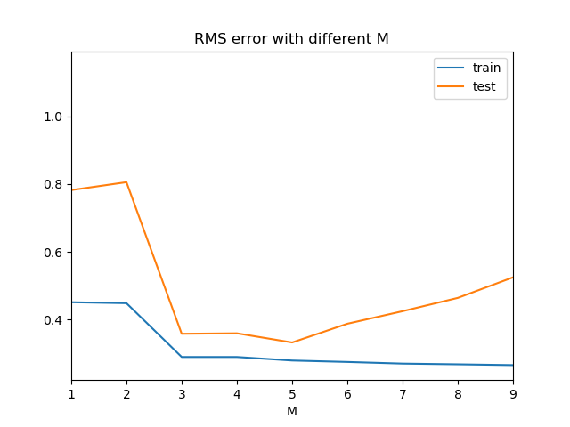
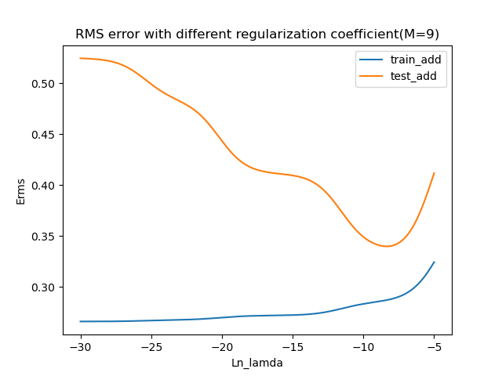
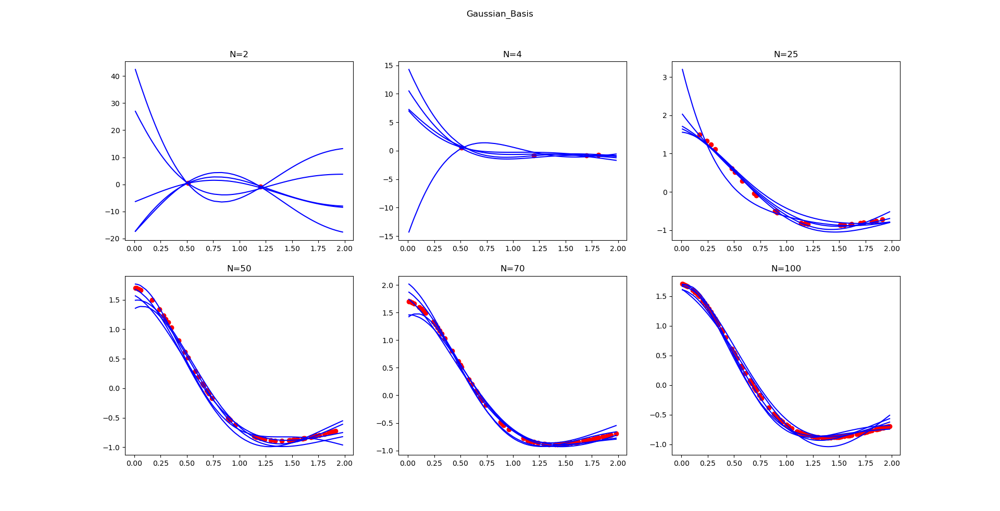
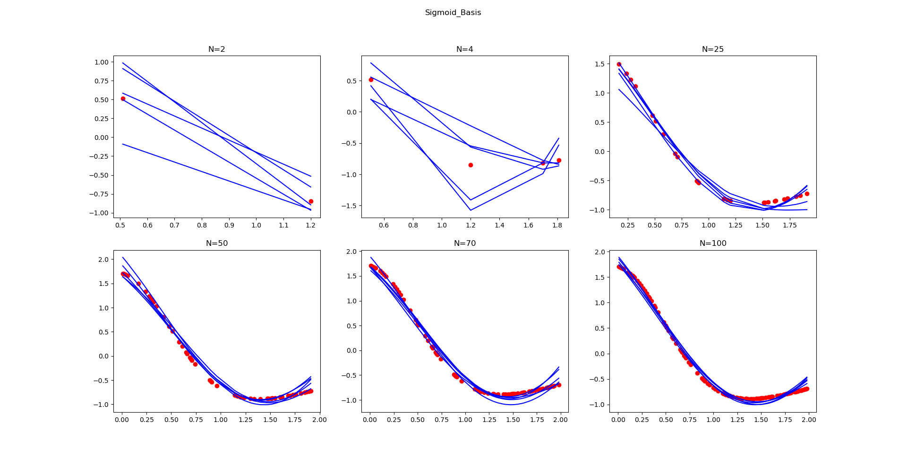
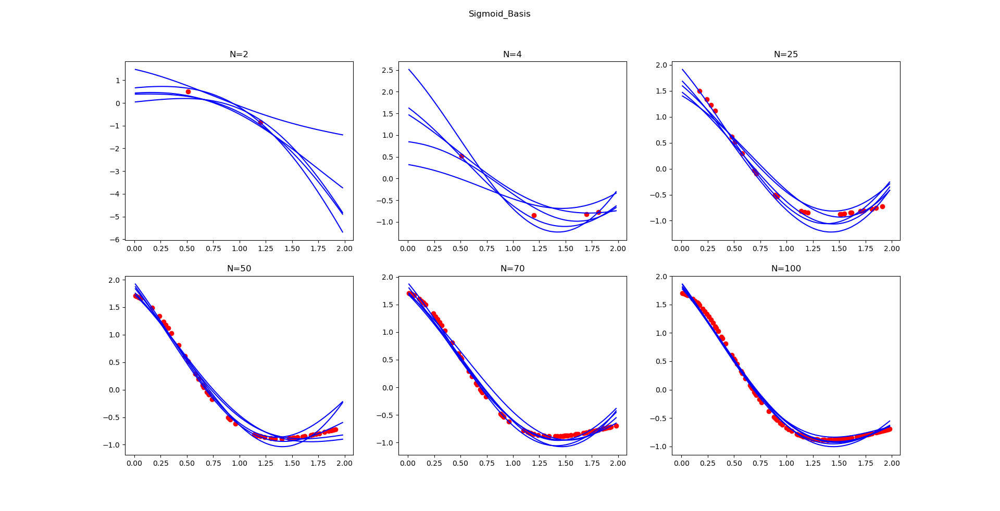
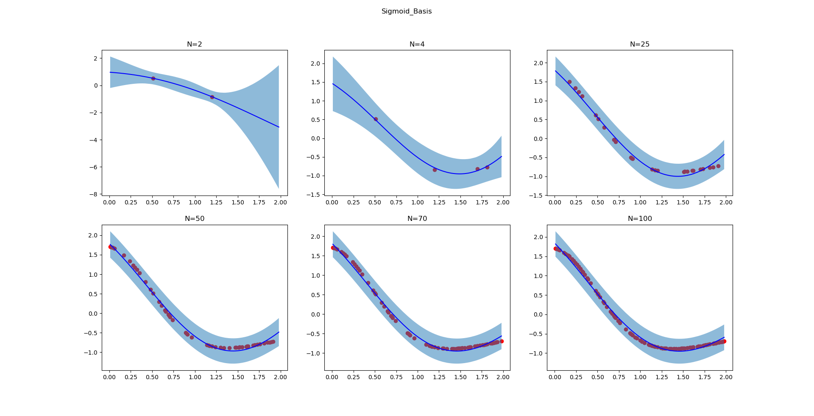

# PRML_practice
Some practice for the book : Bishop - Pattern Recognition and Machine Learning
# 1.Regression
  (1) 1-dim Polynomial regression
  
      a. plot the RMS error versus M ( Amount of feature )
      
      b. plot the RMS error versus regularization coefficient(log-scale)
      
   
  
  (2) D-dim Polynomial regression
  
  (3) Bayesian linear regression (Gaussian basis functions)
      
      Compare the performance with different data size N
      
  
   
  
  (4) Bayesian linear regression (Sigmoid basis functions)
      
      Compare the performance with different data size N
      

 

# 2. Classification
  (1) Perceptron
      
      Implement a perceptron learning algorithm
      
   
  
  (2) Logistic regression
      
      Implement the Newton-Raphson algorithm
      
      a. plot the learning curve of Crossentropy error function
      
      b. plot the learning curve of Accuracy
      
  (3) Neural network
      
      Implement forward-propagation, back-propagation and stochastic gradient descent algorithm.
      
      Using Ionosphere dataset , Iris dataset and Wine dataset
      
      a. plot the learning curve of Crossentropy error function
      
      b. plot the learning curve of Accuracy
      
       
 
      Activation funtion :
      
      1.NN_datasetname : hidden layer -> sigmoid
                         output layder -> softmax
                         
      2.2NN_datasetname: hidden layer -> Can choose for yourself
                         output layder -> softmax
                         
# 3.SVM(Support vector machine)

Implement a support vector machine (SVM).
Using Gaussian kernel and CVXOPT to slove the quadratic programming problem.

 
 

# 4.Gaussian mixture model with K-means and EM algorithm
Using Gaussian mixture model (GMM) and the expectation-maximization (EM) algorithm with initialization using K-means. 
K=2&nbsp;&nbsp;&nbsp;K=3 
 

 

 
